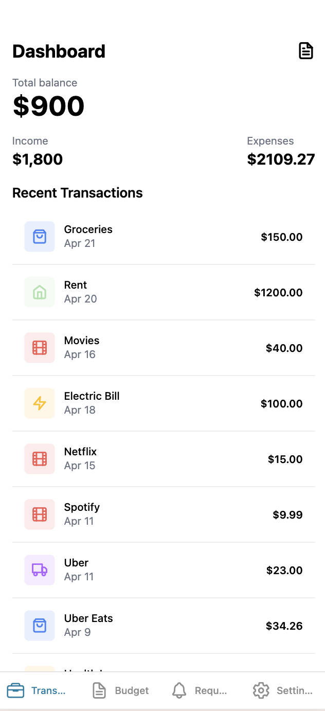
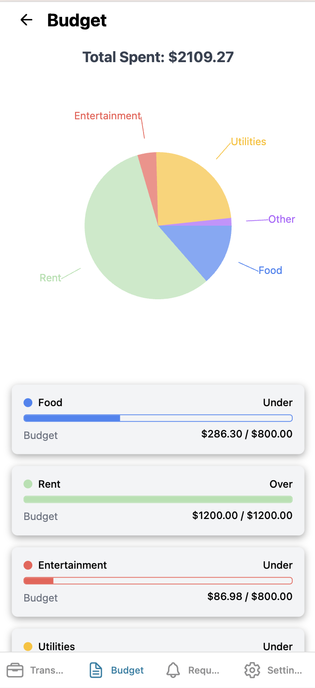
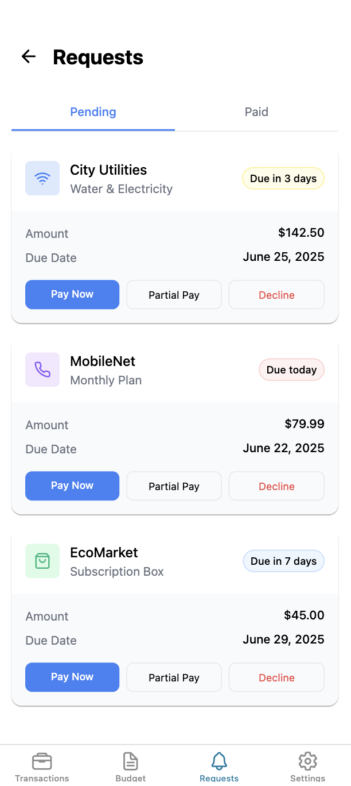
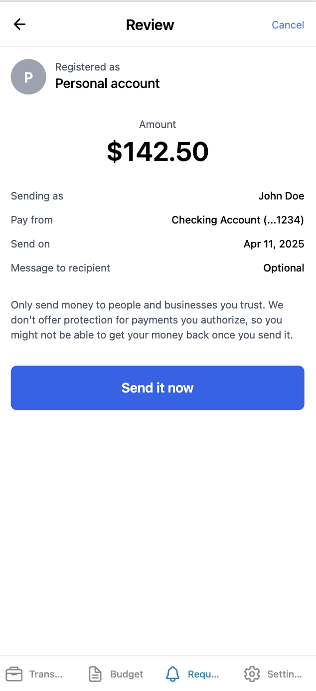
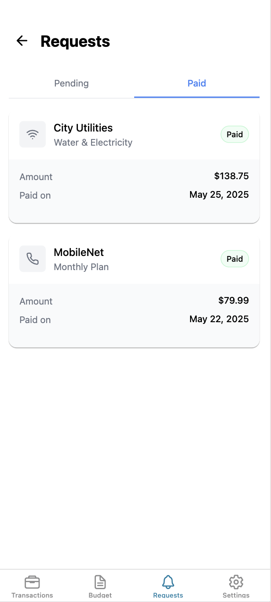
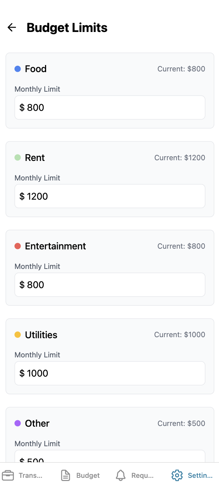

# Mobile Banking App with AI 📊

A React Native app built with Expo for managing personal finances, budgets, tracking expenses, and with a built-in chat assistant.

<div style="display: flex; flex-direction: row; flex-wrap: wrap;">
    
    
    
    
    
    
    
</div>

## Features

- 📈 Budget tracking with dynamic pie chart visualization
- 💰 Transaction management and categorization
- 🎯 Customizable budget limits for different categories
- 📱 Cross-platform support (iOS, Android, Web)
- 💾 Persistent storage of user preferences and budget data


## Getting Started

1. Install dependencies
   ```bash
   npm install
   ```
   
2. Install required packages
   ```bash
   npx expo install @react-native-async-storage/async-storage
   ```
   
3. Start the app
   ```bash
   npx expo start
   ```

## Project Structure

- `app/` - Main application code
  - `(tabs)/` - Tab-based navigation
    - `(Budget)/` - Budget visualization and management
    - `(Transactions)/` - Transaction listing and tracking
    - `(Settings)/` - App settings and budget limits
- `data/` - JSON data files
  - `categoryMappings.json` - Category definitions and transaction mappings
  - `transactions.json` - Transaction data
- `assets/` - Images and other static assets
  - `screenshots/` - Application screenshots

## Usage

### Managing Budget Limits
1. Navigate to Settings > Budget Limits
2. Enter monthly limits for each category
3. Click "Save Limits" to store your preferences

### Viewing Transactions
- Recent transactions are automatically categorized
- View spending patterns in the Budget tab
- Track expenses against category limits

## Technologies Used

- [Expo](https://expo.dev)
- [React Native](https://reactnative.dev)
- [AsyncStorage](https://react-native-async-storage.github.io/async-storage/)
- [React Navigation](https://reactnavigation.org)

## Development

To modify category mappings or add new features:

1. Edit category definitions in `data/categoryMappings.json`
2. Update transaction data in `data/transactions.json`
3. Modify component code in the respective tab directories

## Learn More

- [Expo Documentation](https://docs.expo.dev/)
- [React Native Documentation](https://reactnative.dev/docs/getting-started)

## Join the community

Join our community of developers creating universal apps.

- [Expo on GitHub](https://github.com/expo/expo): View our open source platform and contribute.
- [Discord community](https://chat.expo.dev): Chat with Expo users and ask questions.
