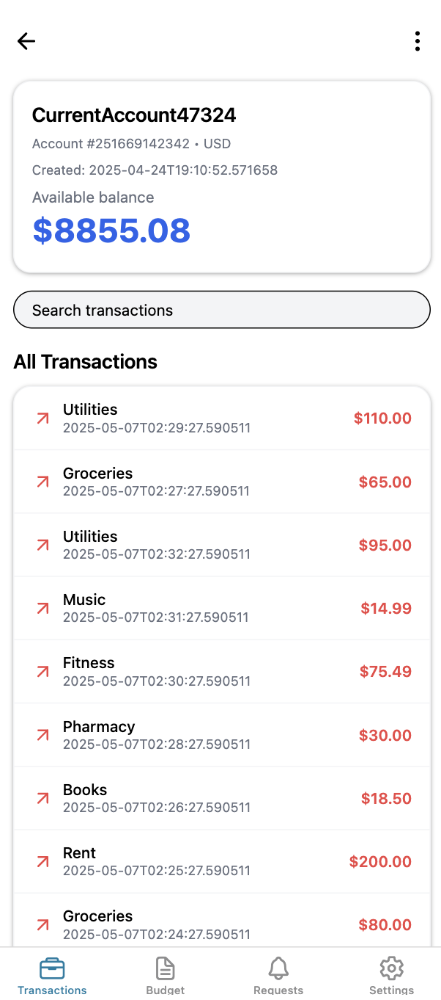

# Personal Finance App 💰

A React Native app built with Expo for managing personal finances, tracking expenses, and managing bank accounts with a modern, intuitive interface.

<div style="display: flex; flex-direction: row; flex-wrap: wrap; gap: 15px; justify-content: center;">
    
    
    
    
    
    
    
    
    
</div>

## Features

### Dashboard
- 📊 Overview of all bank accounts
- 💳 Quick access to account balances
- 📈 Recent transactions summary
- 🔄 Real-time balance updates

### Budget Management
- 📈 Interactive pie chart visualization
- 🎯 Category-based spending tracking
- 💰 Customizable budget limits
- 🚨 Visual alerts for over-budget categories
- 📊 Detailed spending breakdown

### Bank Accounts
- 🏦 Multiple account support
- 💳 Account balance tracking
- 🔄 Transaction history
- 📱 Easy account management
- 🔒 Secure account information

### Transactions
- 📝 Detailed transaction history
- 🏷️ Automatic categorization
- 🔍 Search and filter capabilities
- 📅 Date-based organization
- 💰 Amount tracking

## Getting Started

1. Clone the repository
   ```bash
   git clone [repository-url]
   cd pf-app
   ```

2. Install dependencies
   ```bash
   npm install
   ```

3. Start the development server
   ```bash
   npx expo start
   ```

## Project Structure

```
pf-app/
├── app/
│   ├── (tabs)/
│   │   ├── (Budget)/
│   │   │   └── budget.tsx
│   │   ├── (Transactions)/
│   │   │   └── dashboard.tsx
│   │   └── (Settings)/
│   │       ├── settings.tsx
│   │       ├── bankAccounts.tsx
│   │       ├── addAccount.tsx
│   │       └── budgetLimits.tsx
├── data/
│   ├── categoryMappings.json
│   └── transactions.json
└── assets/
    └── screenshots/
```

## Key Components

### Budget Management
- Dynamic pie chart visualization
- Category-based spending tracking
- Progress bars for budget limits
- Color-coded status indicators

### Bank Account Management
- Account creation and management
- Balance tracking
- Transaction history
- Secure account information

### Settings
- Budget limit configuration
- Account management
- Category customization
- App preferences

## Technologies Used

- [Expo](https://expo.dev) - React Native framework
- [React Native](https://reactnative.dev) - Mobile app development
- [NativeWind](https://www.nativewind.dev) - Styling
- [React Native SVG](https://github.com/react-native-svg/react-native-svg) - Chart visualization
- [React Native Progress](https://github.com/oblador/react-native-progress) - Progress indicators

## Development

### Adding New Features
1. Create new components in the appropriate directory
2. Update the navigation structure if needed
3. Add any required data to the JSON files
4. Test thoroughly on both iOS and Android

### Modifying Categories
1. Edit `data/categoryMappings.json`
2. Update transaction mappings
3. Adjust budget limits as needed

### Styling
- Uses NativeWind for styling
- Follows the existing design system
- Maintains consistent spacing and typography

## Contributing

1. Fork the repository
2. Create your feature branch
3. Commit your changes
4. Push to the branch
5. Create a Pull Request

## License

This project is licensed under the MIT License - see the LICENSE file for details.

## Support

For support, please open an issue in the GitHub repository or contact the development team.
