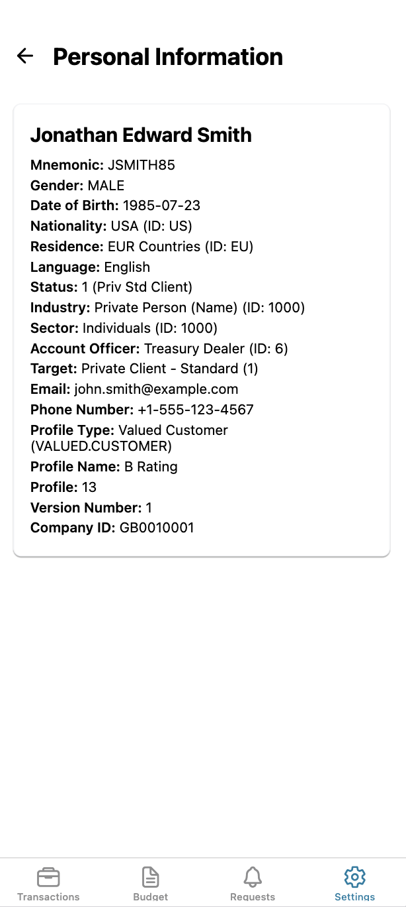
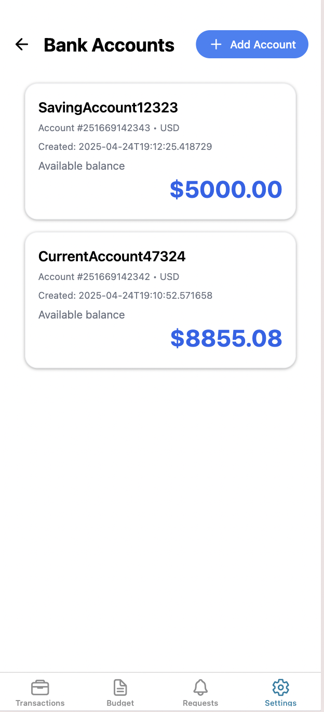
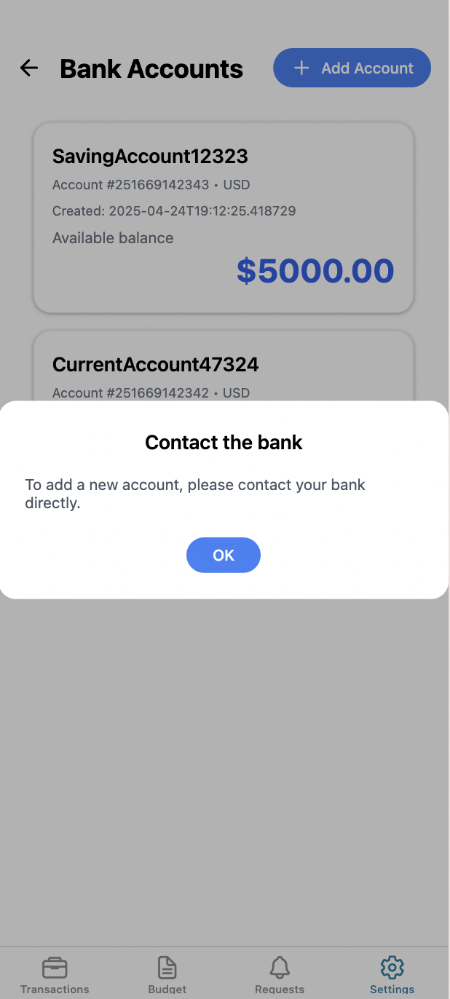
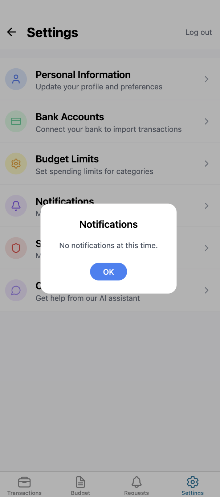
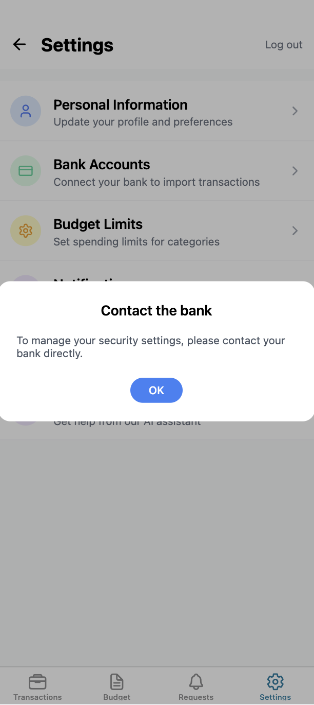

# MOBILE BANKING APP WITH AI 

A React Native app built with Expo for managing personal finances, tracking expenses, and managing bank accounts with a modern, intuitive interface. The app integrates with a FastAPI backend for secure data management and real-time updates.

<div style="display: flex; flex-direction: row; flex-wrap: wrap; gap: 15px; justify-content: center;">
   
   
   
   
   
   
   
   
   
   
   
   
   
   
   
</div>

## Features

### Dashboard
- 📊 Overview of all bank accounts
- 💳 Quick access to account balances
- 📈 Recent transactions summary
- 🔄 Real-time balance updates
- 🔐 Secure user authentication
- 👤 User-specific data with party_id
- 🎯 Clean, modern UI with intuitive navigation

### Budget Management
- 📈 Interactive pie chart visualization
- 🎯 Category-based spending tracking
- 💰 Customizable budget limits
- 🚨 Visual alerts for over-budget categories
- 📊 Detailed spending breakdown
- 🔄 Real-time budget updates
- 🎨 Color-coded status indicators

### Bank Accounts
- 🏦 Multiple account support
- 💳 Account balance tracking
- 🔄 Transaction history
- 📱 Easy account management
- 🔒 Secure account information
- ➕ Add new accounts functionality
- 🔍 Detailed account views

### Transactions
- 📝 Detailed transaction history
- 🏷️ Automatic categorization
- 🔍 Search and filter capabilities
- 📅 Date-based organization
- 💰 Amount tracking
- 🔄 Real-time transaction updates
- 📱 Responsive transaction list

### Settings
- 👤 Personal Information management
- 🏦 Bank account management
- 💰 Budget limits configuration
- 🔔 Notification preferences with modal interface
- 🔒 Security settings with bank contact modal
- 💬 AI Chatbot support
- 🎨 Modern, intuitive UI
- 🔄 Seamless navigation

## Getting Started

1. Clone the repository
   ```bash
   git clone [repository-url]
   cd pf-app
   ```

2. Install dependencies
   ```bash
   npm install
   ```

3. Start the backend server
   ```bash
   cd backend
   uvicorn main:app --reload
   ```

4. Start the development server
   ```bash
   npx expo start
   ```

## Project Structure

```
pf-app/
├── app/
│   ├── (tabs)/
│   │   ├── (Budget)/
│   │   │   └── budget.tsx
│   │   ├── (Transactions)/
│   │   │   ├── dashboard.tsx
│   │   │   └── accountDetails.tsx
│   │   └── (Settings)/
│   │       ├── settings.tsx
│   │       ├── bankAccounts.tsx
│   │       ├── addAccount.tsx
│   │       └── budgetLimits.tsx
├── __tests__/
│   ├── components/
│   │   ├── BudgetView.test.tsx
│   │   ├── BankAccounts.test.tsx
│   │   ├── AddAccount.test.tsx
│   │   ├── Dashboard.test.tsx
│   │   └── AddTransaction.test.tsx
├── data/
│   ├── categoryMappings.json
│   └── transactions.json
└── assets/
    └── screenshots/
```

## Testing

The project uses Jest for testing. To run tests:

```bash
# Run all tests
npm test

# Run tests with coverage
npm test -- --coverage

# Run specific test file
npm test -- path/to/test/file.test.tsx

# Run tests in watch mode
npm test -- --watch
```

## Key Components

### Budget Management
- Dynamic pie chart visualization
- Category-based spending tracking
- Progress bars for budget limits
- Color-coded status indicators
- Real-time updates from backend
- Interactive category management

### Bank Account Management
- Account creation and management
- Balance tracking
- Transaction history
- Secure account information
- Party-specific account views
- Modern card-based UI

### Settings
- Budget limit configuration
- Account management
- Category customization
- App preferences
- User profile management
- Modal-based notifications
- Security settings with bank contact
- AI-powered chatbot support

## Technologies Used

- [Expo](https://expo.dev) - React Native framework
- [React Native](https://reactnative.dev) - Mobile app development
- [NativeWind](https://www.nativewind.dev) - Styling
- [React Native SVG](https://github.com/react-native-svg/react-native-svg) - Chart visualization
- [React Native Progress](https://github.com/oblador/react-native-progress) - Progress indicators
- [FastAPI](https://fastapi.tiangolo.com) - Backend API
- [Jest](https://jestjs.io) - Testing framework
- [Expo Router](https://docs.expo.dev/router/introduction/) - Navigation
- [Lucide React Native](https://lucide.dev) - Icon library

## Development

### Adding New Features
1. Create new components in the appropriate directory
2. Update the navigation structure if needed
3. Add any required data to the JSON files
4. Write tests for new components
5. Test thoroughly on both iOS and Android
6. Follow the established UI/UX patterns

### Backend Integration
1. All API calls use the correct port (8000)
2. Party ID is passed through navigation
3. Error handling for API calls
4. Secure authentication flow
5. Proper error state management

### Styling
- Uses NativeWind for styling
- Follows the existing design system
- Maintains consistent spacing and typography
- Responsive design for all screen sizes
- Modern modal interfaces
- Consistent color scheme

## Contributing

1. Fork the repository
2. Create your feature branch
3. Write tests for new features
4. Commit your changes
5. Push to the branch
6. Create a Pull Request

## License

This project is licensed under the MIT License - see the LICENSE file for details.

## Support

For support, please open an issue in the GitHub repository or contact the development team.
