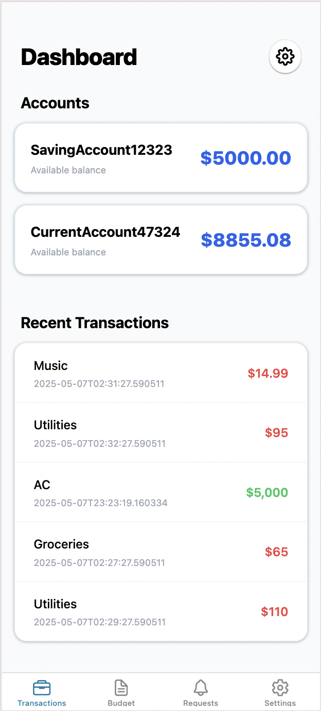
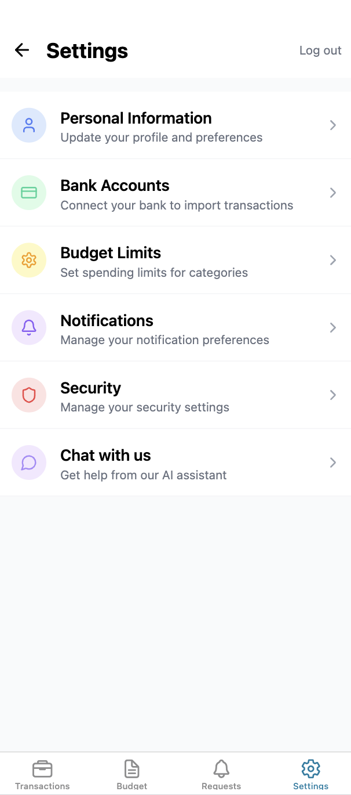

# Mobile Banking App with AI 📊

A React Native app built with Expo for managing personal finances, budgets, tracking expenses, and featuring an AI-powered financial assistant.

<div style="display: flex; flex-direction: row; flex-wrap: wrap; gap: 15px; justify-content: center;">
    
    
    
    
    
    
    
    
</div>

## Features

- 📈 Budget tracking with dynamic pie chart visualization
- 💰 Transaction management and categorization
- 🎯 Customizable budget limits for different categories
- 🤖 AI-powered financial assistant for personalized advice
- 📱 Cross-platform support (iOS, Android, Web)
- 💾 Persistent storage of user preferences and budget data
- 💬 Real-time chat interface for financial guidance
- 📊 Interactive spending analytics and insights

## AI Financial Assistant

Our built-in AI assistant helps you with:
- Personalized budgeting advice
- Expense tracking strategies
- Investment recommendations
- Debt management tips
- Savings goals planning
- General financial education

## Getting Started

1. Install dependencies
   ```bash
   npm install
   ```
   
2. Configure environment variables
   ```bash
   # Create a .env file and add:
   EXPO_PUBLIC_CHATBOT_API_KEY=your_api_key
   EXPO_PUBLIC_CHATBOT_API_URL=your_api_url
   ```
   
4. Start the app
   ```bash
   npx expo start
   ```

## Project Structure

- `app/` - Main application code
  - `(tabs)/` - Tab-based navigation
    - `(Budget)/` - Budget visualization and management
    - `(Transactions)/` - Transaction listing and tracking
    - `(Settings)/` - App settings and budget limits
      - `chatbot.tsx` - AI Financial Assistant interface
- `data/` - JSON data files
  - `categoryMappings.json` - Category definitions and transaction mappings
  - `transactions.json` - Transaction data
- `assets/` - Images and other static assets
  - `screenshots/` - Application screenshots

## Usage

### Managing Budget Limits
1. Navigate to Settings > Budget Limits
2. Enter monthly limits for each category
3. Click "Save Limits" to store your preferences

### Using the AI Financial Assistant
1. Access the chatbot from the Settings menu
2. Ask questions about your finances
3. Get personalized advice and recommendations
4. Learn about budgeting and financial management

### Viewing Transactions
- Recent transactions are automatically categorized
- View spending patterns in the Budget tab
- Track expenses against category limits

## Technologies Used

- [Expo](https://expo.dev)
- [React Native](https://reactnative.dev)
- [React Navigation](https://reactnavigation.org)
- [NativeWind](https://www.nativewind.dev)
- [OpenAI API](https://openai.com) (or your chosen AI provider)

## Development

To modify category mappings or add new features:

1. Edit category definitions in `data/categoryMappings.json`
2. Update transaction data in `data/transactions.json`
3. Modify component code in the respective tab directories
4. Configure AI assistant parameters in the chatbot component

## Learn More

- [Expo Documentation](https://docs.expo.dev/)
- [React Native Documentation](https://reactnative.dev/docs/getting-started)
- [NativeWind Documentation](https://www.nativewind.dev/overview/)

## Join the community

Join our community of developers creating universal apps.

- [Expo on GitHub](https://github.com/expo/expo): View our open source platform and contribute.
- [Discord community](https://chat.expo.dev): Chat with Expo users and ask questions.
